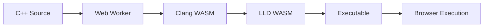

# Panda Edit - Web-Based C++ IDE

A powerful C++ IDE that runs entirely in your browser using WebAssembly technology. This is not just a syntax highlighter - it's a full-featured development environment with real C++ compilation and execution capabilities.

  

## ✨ Features

### 🚀 Real C++ Compilation
- **Actual Clang Compiler**: Uses real WebAssembly-based Clang/LLD binaries
- **Live Compilation**: Compile C++ code instantly in your browser
- **Execution**: Run compiled programs directly in the browser
- **Error Handling**: Detailed compiler output and error reporting

### 💻 Professional Editor
- **Syntax Highlighting**: Full C++ syntax highlighting with Ace Editor
- **40+ Themes**: Extensive collection of professional editor themes
- **Code Completion**: Intelligent code completion and suggestions
- **Keyboard Shortcuts**: Customizable shortcuts for productivity

### 📁 File Management
- **Local Storage**: Persistent code saving in browser storage
- **Default Templates**: Pre-configured C++ templates for quick start
- **File Operations**: Create, edit, and manage C++ source files

### 🎨 Modern UI
- **Dark Theme**: Professional dark interface
- **Split Layout**: Editor and terminal areas for optimal workflow
- **Responsive Design**: Works on desktop and tablet browsers
- **Status Indicators**: Real-time compilation and execution status

## 🛠 Technology Stack

- **Framework**: Astro 5.15.5
- **Package Manager**: Bun
- **Editor**: Ace Editor
- **Compiler**: Clang/LLD WebAssembly
- **Language**: TypeScript
- **Runtime**: WebAssembly

## 🚀 Quick Start

### Prerequisites
- Modern web browser with WebAssembly support
- Bun runtime (for development)

### Installation

1. **Clone the repository**
   ```bash
   git clone https://github.com/yourusername/panda-edit.git
   cd panda-edit
   ```

2. **Install dependencies**
   ```bash
   bun install
   ```

3. **Start development server**
   ```bash
   bun run dev
   ```

4. **Open in browser**
   Navigate to `http://localhost:4321`

### Production Build

```bash
bun run build
```

The built files will be in the `dist/` directory, ready for deployment.

## 📖 Usage

1. **Write Code**: Start writing C++ code in the editor
2. **Compile**: Click the Run button or use `Ctrl+Enter`
3. **View Output**: See compilation results and program output in the terminal
4. **Save Work**: Your code is automatically saved to browser storage

### Example Code

Try this simple "Hello World" program:

```cpp
#include <iostream>

int main() {
    std::cout << "Hello, Panda Edit!" << std::endl;
    return 0;
}
```

## 🏗 Architecture

### Core Components

- **`web.js`**: Main application class and UI management
- **`cpp_compiler.js`**: C++ compilation interface
- **`compiler_worker.js`**: Web Worker for WASM compilation
- **`shared.js`**: File management and utilities
- **`shortcuts.js`**: Keyboard shortcut system

### WebAssembly Integration

- **clang.wasm**: C++ compiler binary
- **lld.wasm**: LLVM linker binary
- **memfs.wasm**: Memory filesystem
- **sysroot.tar**: System root environment

### Build Process



## 🎯 Key Features Deep Dive

### Real Compilation
Unlike online code editors that only provide syntax highlighting, Panda Edit actually compiles C++ code using the same Clang compiler used in professional development environments.

### Browser-Based Execution
Compiled programs run directly in the browser using WebAssembly, providing a sandboxed yet powerful execution environment.

### Professional Editor Experience
- Multiple cursor support
- Search and replace functionality
- Bracket matching
- Auto-indentation
- Multiple professional themes

## 🔧 Configuration

### Environment Setup
The project uses Bunfig for package management configuration:

```toml
[install]
cache = false
frozen-lockfile = false

[deploy]
allowed-hostnames = ["https://registry.npmjs.org"]
```

### Astro Configuration
Optimized for WebAssembly with proper CORS headers:

```javascript
export default defineConfig({
  output: 'static',
  adapter: netlify(),
  vite: {
    server: {
      headers: {
        'Cross-Origin-Opener-Policy': 'same-origin',
        'Cross-Origin-Embedder-Policy': 'require-corp',
      }
    }
  }
});
```

## 🚀 Deployment

### GitHub Pages
The project includes automated GitHub Pages deployment via GitHub Actions:

```yaml
name: Deploy to GitHub Pages
on:
  push:
    branches: [main]
jobs:
  build-and-deploy:
    runs-on: ubuntu-latest
    steps:
      - uses: actions/checkout@v4
      - uses: oven-sh/setup-bun@v2
      - run: bun install
      - run: bun run build
      - uses: peaceiris/actions-gh-pages@v4
        with:
          github_token: ${{ secrets.GITHUB_TOKEN }}
          publish_dir: ./dist
```

### Manual Deployment
Build the project and deploy the `dist/` folder to any static hosting service.

## 🤝 Contributing

1. Fork the repository
2. Create a feature branch: `git checkout -b feature-name`
3. Make your changes
4. Test thoroughly in the browser
5. Commit changes: `git commit -m 'Add feature description'`
6. Push to branch: `git push origin feature-name`
7. Open a Pull Request

### Development Guidelines
- Maintain TypeScript strict mode compliance
- Test WebAssembly functionality thoroughly
- Ensure cross-browser compatibility
- Follow existing code style and patterns

## 🐛 Troubleshooting

### Common Issues

**WebAssembly Not Loading**
- Ensure browser supports WebAssembly
- Check for CORS policy issues
- Verify proper headers are set

**Compilation Errors**
- Check C++ code syntax
- Ensure proper includes
- Review compiler output for details

**Performance Issues**
- Large compilations may take time
- Consider browser memory limitations
- Check developer console for errors

## 📄 License

This project is licensed under the MIT License - see the [LICENSE](LICENSE) file for details.

## 🙏 Acknowledgments

- **Ace Editor**: For the excellent web-based code editor
- **Clang/LLVM**: For the powerful C++ compiler toolchain
- **WebAssembly**: For enabling native code execution in browsers
- **Astro**: For the modern static site framework
- **Bun**: For the fast JavaScript runtime

## 📞 Support

For issues, questions, or contributions:
- Open an issue on GitHub
- Check the troubleshooting section
- Review the code comments for additional context

---

**Panda Edit** - Bringing professional C++ development to your browser 🐼✨